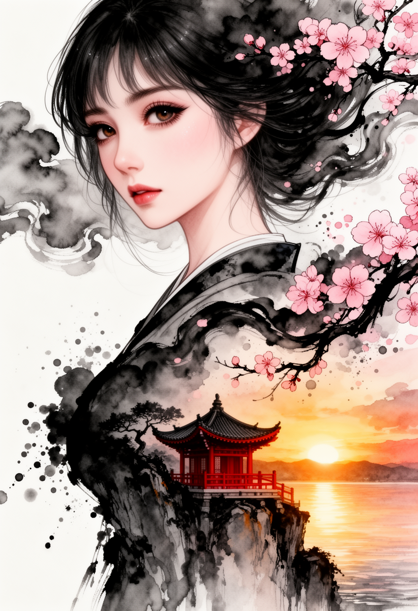
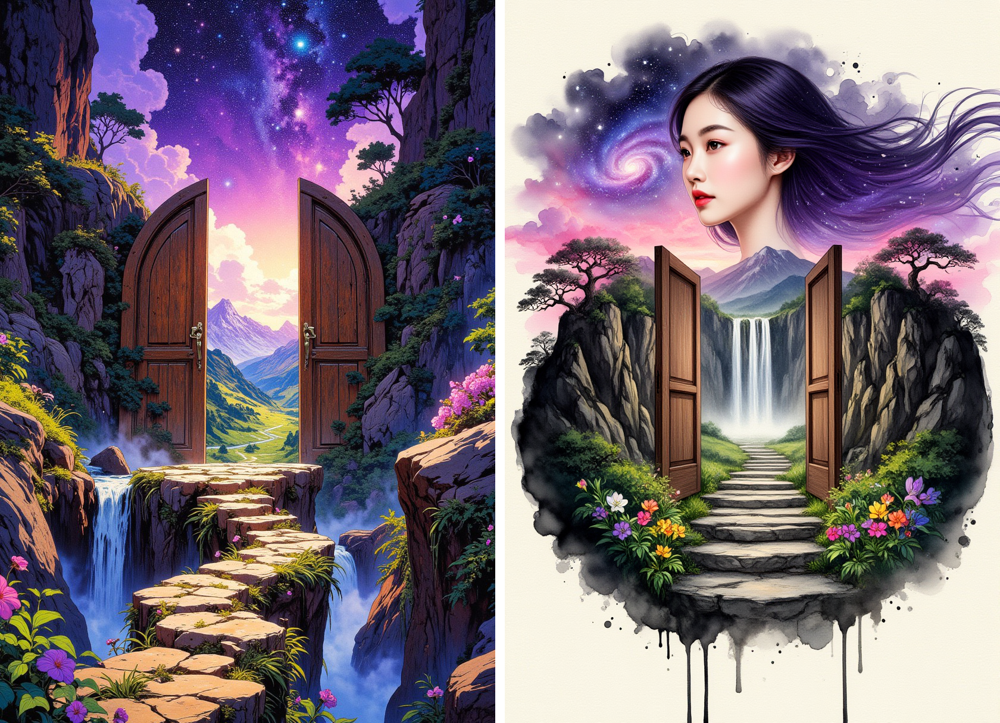
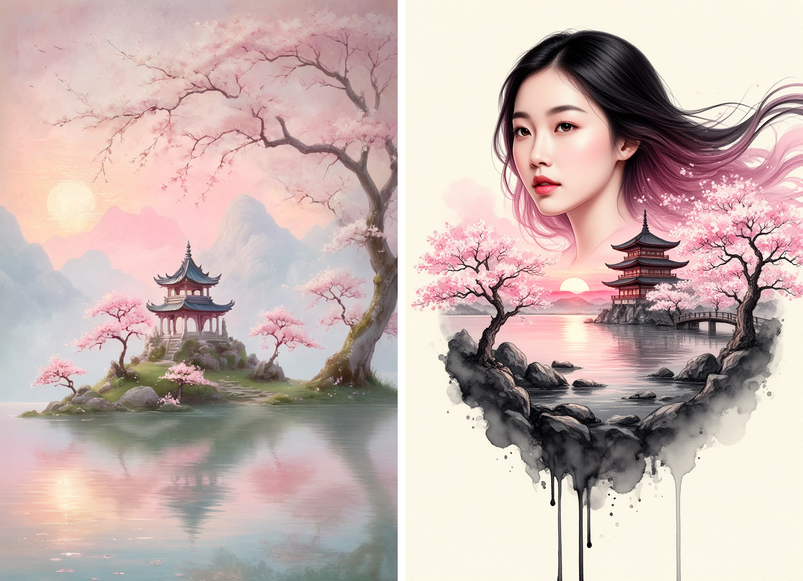
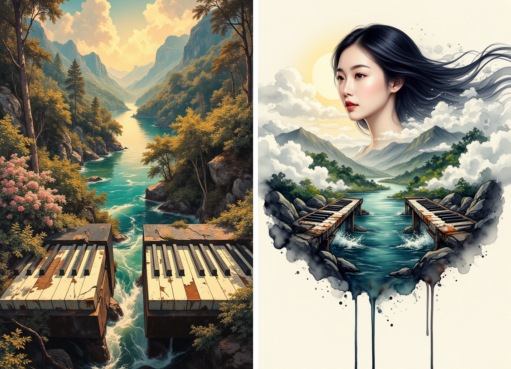
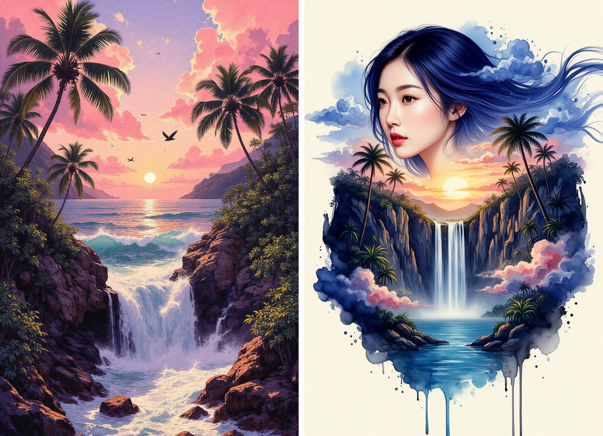
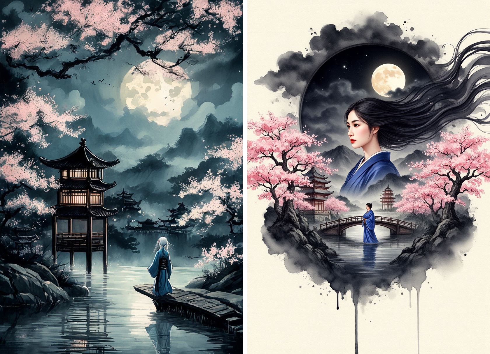
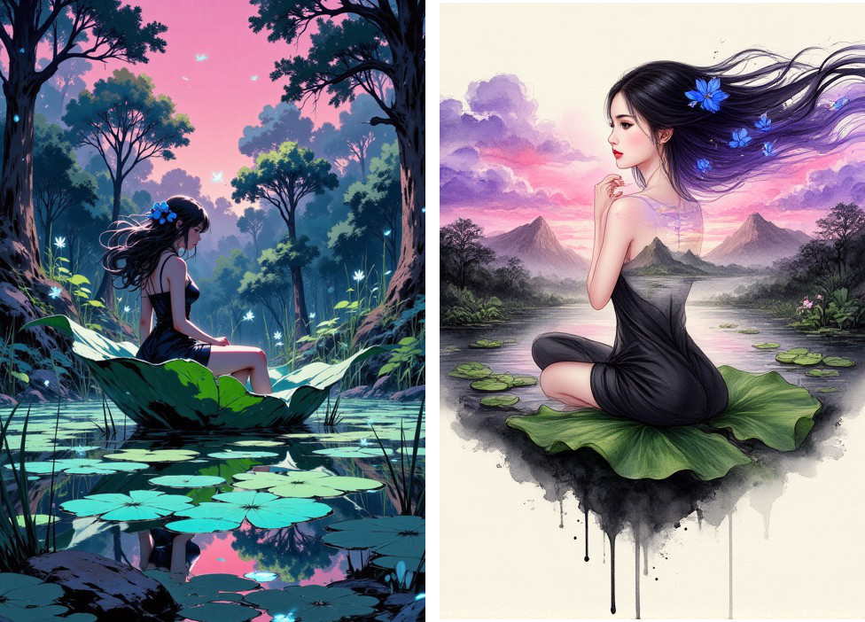
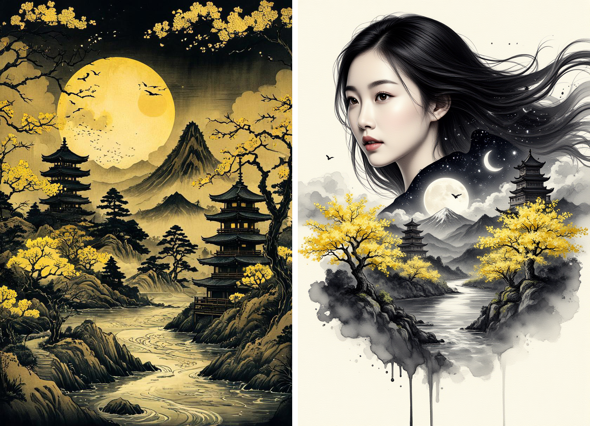
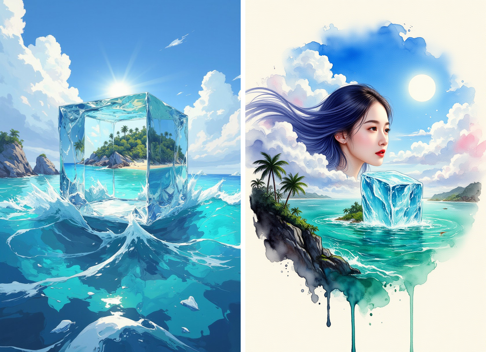

# Double Exposure LoRA

[中文](#中文说明) | [English](#english)

---

## 中文说明

### 项目简介

这是一个我微调的 **双重曝光（Double Exposure）风格 LoRA**。  
你可以把自己的图片作为输入，生成带有当前风格特征的图像结果；同时通过调整参数，也可以得到不同强度和表现方式的效果。

### 我做了什么

1. 微调了一个风格化 LoRA：`Style_DoubleExposure.safetensors`
2. 准备了输入与输出的对比样例
3. 提供了拼接对比脚本，方便查看效果差异

### 文件结构

```text
.
├─ Style_DoubleExposure.safetensors   # LoRA 权重
├─ README.md
├─ LICENSE                            # Apache-2.0
├─ merge_side_by_side.py              # 对比图拼接脚本
├─ 1.jpeg ... 9.jpeg                  # 输入示例
├─ new_flow1.png ... new_flow9.png    # 生成结果示例
└─ merged/
   ├─ Flux2_00001_.png                # 我最满意的一张作品
   └─ merged_1.png ... merged_9.png   # 左右对比图（缺 8）
```

### 如何使用这个 LoRA

1. 将 `Style_DoubleExposure.safetensors` 放到你的 LoRA 目录（例如 WebUI/ComfyUI 对应的 `loras` 目录）。
2. 选择你常用的底模与工作流（文生图或图生图均可）。
3. 加载本 LoRA，输入提示词并生成。
4. 如果想更贴近本项目风格，可优先从图生图开始，用自己的照片/图像作为输入。

### 参数建议（可按需调整）

- LoRA 权重：`0.7 ~ 1.1`（推荐从 `0.85` 起）
- 图生图重绘强度：`0.30 ~ 0.60`
- 采样步数：`20 ~ 35`
- 提示词建议：突出 “double exposure, silhouette, layered texture, cinematic lighting” 等关键词

### 效果展示

最满意作品：



对比图（左：输入，右：风格结果）：










### 许可证

本项目采用 **Apache License 2.0**，详见 [LICENSE](LICENSE)。

---

## English

### Overview

This repository contains my fine-tuned **Double Exposure style LoRA**.  
You can feed in your own image and generate outputs in this style. By tuning inference parameters, you can also get varied stylistic intensity and different visual moods.

### What I did

1. Fine-tuned a style LoRA: `Style_DoubleExposure.safetensors`
2. Prepared input/output comparison examples
3. Added a side-by-side merge script for quick visual evaluation

### Project Structure

```text
.
├─ Style_DoubleExposure.safetensors   # LoRA weights
├─ README.md
├─ LICENSE                            # Apache-2.0
├─ merge_side_by_side.py              # merge script for comparisons
├─ 1.jpeg ... 9.jpeg                  # sample inputs
├─ new_flow1.png ... new_flow9.png    # sample outputs
└─ merged/
   ├─ Flux2_00001_.png                # my favorite result
   └─ merged_1.png ... merged_9.png   # side-by-side comparisons (no 8)
```

### How to Use This LoRA

1. Put `Style_DoubleExposure.safetensors` into your LoRA folder (e.g., your WebUI/ComfyUI LoRA path).
2. Use your preferred base model and workflow (text-to-image or image-to-image).
3. Load this LoRA and run inference with your prompt.
4. For closest style transfer, start with image-to-image using your own photo/art as input.

### Recommended Settings (Adjust Freely)

- LoRA weight: `0.7 ~ 1.1` (start from `0.85`)
- Img2img denoise strength: `0.30 ~ 0.60`
- Sampling steps: `20 ~ 35`
- Prompt hint keywords: `double exposure, silhouette, layered texture, cinematic lighting`

### Results

Favorite piece:


Comparisons (left: input, right: stylized output):


### License

This project is licensed under the **Apache License 2.0**. See [LICENSE](LICENSE) for details.
